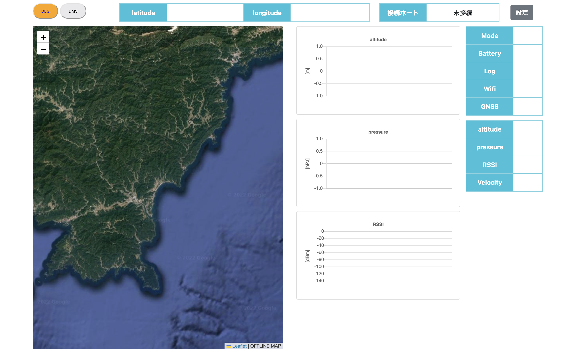
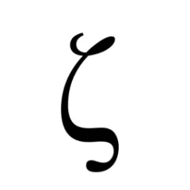

# GroundSystem_GUI_Project

- [日本語版](doc/README.ja.md)

The **GroundSystem_GUI_Project** was developed in response to a request from the electrical team leader during **ANCO-project 2022** to create a GUI for telemetry monitoring.

This system provides a **user-friendly** and **convenient** way to visualize telemetry data.

Additionally, **map data of the area around the launch site in Ehime Prefecture can be used offline**.

<p align="center">
    
</p>

## 🚀 Features

- **User-friendly GUI**: Easily visualize telemetry data in real-time.
- **Offline map support**: Preloaded map data allows operation even without an internet connection.
- **Customizable data stråucture**: Modify how telemetry data is processed and displayed.
- **Multi-user access**: Run the server on a local or remote machine, allowing multiple users to access telemetry data.
- **Supports both CLI and GUI operation**: Run via Flask web server or directly with Python.

## 📌 Usage and Installation

### 1. Clone the repository

```sh
git clone git@github.com:Akatoki-Saidai/GroundSystem_GUI_Project.git
cd GroundSystem_GUI_Project
```

### 2. Install required dependencies

(Optional) If you prefer using a virtual environment:

```sh
python -m venv flask-env
source flask-env/bin/activate  # On Windows, use `flask-env\Scripts\activate`
```

Then install the required modules:

```sh
pip install -r requirements.txt
```

### 3. Run the server

You can start the server using **Flask**:

```sh
flask --app app run
```

or (Recommended):

```sh
python app.py
```

## 🗂️ Data Structure

Telemetry data is received via **UART** in a **comma-delimited format** per line.

By default, the structure is:

```txt
latitude, longitude, altitude, barometric pressure, RSSI, mode, battery, logging status, WiFi status, GNSS status
```

Example:

```txt
0.0, 0.0, -17, 0.0, -50, Mode:wait, Bt:Middle, Log:OFF, WiFi:NG, GNSS:unlock
```

If **binary data** needs to be sent or received, you must modify the code to handle the conversion or ensure that converted data is transmitted via UART.

## 👥 Contributors

<table>
    <tr>
        <td align="center">
            <a href="https://github.com/ddd3h">
                
                <br />
                <sub><b>ddd3h</b></sub>
            </a>
        </td>
        <td align="center">
            <a href="https://github.com/takashin9">
                
                <br />
                <sub><b>takashin9</b></sub>
            </a>
        </td>
    </tr>
</table>