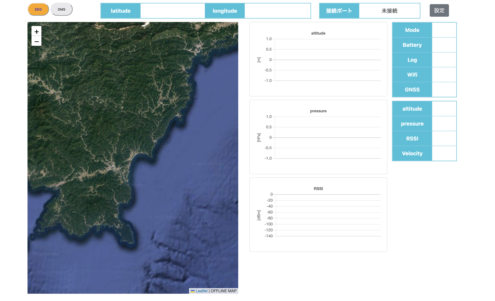

# GroundSystem_GUI_Project（地上システムGUIプロジェクト）

- [English version](../README.md)

**GroundSystem_GUI_Project** は、**ANCO-project 2022** において、電装班班長からの要請に応じて開発されました。このプロジェクトの目的は、**テレメトリ監視用のGUIを作成すること** です。

このシステムにより、**直感的で使いやすいインターフェースを通じて、テレメトリデータを視覚的に確認** できます。

さらに、**愛媛県の打ち上げ地点周辺の地図データをオフラインで利用可能** です。

<p align="center">
    
</p>

## 🚀 特徴

- **ユーザーフレンドリーなGUI**: テレメトリデータをリアルタイムで簡単に可視化  
- **オフラインマップ対応**: あらかじめ読み込んだ地図データを使用でき、インターネット接続がなくても動作  
- **カスタマイズ可能なデータ構造**: テレメトリデータの処理・表示方法を自由に変更可能  
- **マルチユーザーアクセス**: ローカルまたはリモートマシン上でサーバーを実行し、複数ユーザーが同時にデータにアクセス可能  
- **CLI・GUI両方に対応**: FlaskのWebサーバー経由またはPythonスクリプトの直接実行が可能  

## 📌 使用方法とインストール

### 1. リポジトリをクローン

```sh
git clone git@github.com:Akatoki-Saidai/GroundSystem_GUI_Project.git
cd GroundSystem_GUI_Project
```

### 2. 必要な依存関係をインストール

(オプション) 仮想環境を使用する場合:

```sh
python -m venv flask-env
source flask-env/bin/activate  # Windowsの場合は `flask-env\Scripts\activate`
```

次に、必要なモジュールをインストール:

```sh
pip install -r requirements.txt
```

### 3. サーバーを起動

**Flask** を使用してサーバーを起動できます:

```sh
flask --app app run
```

または（推奨）:

```sh
python app.py
```

## 🗂️ データ構造

テレメトリデータは **UART** を介して受信され、**カンマ区切りのフォーマット** で1行ずつ送信されます。

デフォルトのデータ構造は以下の通りです:

```txt
緯度, 経度, 高度, 気圧, RSSI, モード, バッテリー, ログ状態, WiFi状態, GNSS状態
```

データ例:

```txt
0.0, 0.0, -17, 0.0, -50, Mode:wait, Bt:Middle, Log:OFF, WiFi:NG, GNSS:unlock
```

**バイナリデータ** の送受信が必要な場合は、適切な変換処理を追加するか、UARTを介して変換後のデータを送信する必要があります。

## 👥 貢献者

<table>
    <tr>
        <td align="center">
            <a href="https://github.com/ddd3h">
                
                <br />
                <sub><b>ddd3h</b></sub>
            </a>
        </td>
        <td align="center">
            <a href="https://github.com/takashin9">
                
                <br />
                <sub><b>takashin9</b></sub>
            </a>
        </td>
    </tr>
</table>
